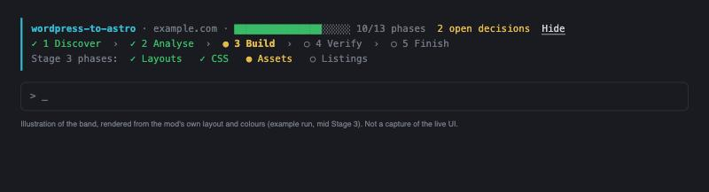

# WordPress to Astro migration skill

 [](https://github.com/nathanpitman/WordPress-to-Astro-migration-skill/actions/workflows/smoke.yml) 

A [Claude Code](https://claude.com/claude-code) skill that migrates a live WordPress (or similar CMS) site to [Astro](https://astro.build) using only what is publicly reachable on the domain. No WordPress admin, database or API credentials are needed.

The goal is a clean cutover with **zero SEO impact**: the rendered HTML of every page is reproduced exactly as served, and the output includes content maps shaped for a future [Payload CMS](https://payloadcms.com) setup.

```
/wordpress-to-astro example.com
```

> **Status: alpha.** The method (crawl, rebuild, then verify every page against the live site) is stable and the pipeline runs end to end on a synthetic WordPress site. It has not yet been proven on a range of real sites. See [Status and known limitations](#status-and-known-limitations) before pointing it at anything that matters, and expect to adapt the reference scripts to the stack you find.

## Progress at a glance



A run has five stages and 13 phases, with a review gate between stages. The optional [progress band](mods/wordpress-to-astro-progress/README.md) keeps your position in view while you work: the green bar is finished phases out of 13 (with open decisions beside it), the middle row is the five stages (`✓` done, `●` current, `○` not started), and the last row is the phases of the current stage. It reads the skill's own `docs/run-state.json`, so it needs no setup beyond loading the mod. *This image is an illustration rendered from the mod's layout and colours (an example run, mid Stage 3), not a capture of the live interface.*

## What it does

- Crawls the site politely, identifying itself honestly, and records the site structure, redirects and unlinked pages
- Rebuilds each page as an Astro project whose rendered output matches the original (head contents, headings, classes, IDs, scripts)
- Extracts content, taxonomies and authors into Payload-shaped content maps
- Inventories SEO facts (titles, descriptions, canonicals, robots, Open Graph, JSON-LD, sitemaps, feeds) and checks the build against them
- Downloads first-party assets to their original URL paths
- Audits accessibility, broken links and other errors, then **records them without fixing them**
- Ends with a verified local build and review server, with a review gate at the end of each of five stages

### Principles

1. **Rendered HTML is sacred.** Nothing is tidied, modernised or "fixed".
2. **Structure the source, not the output.** Components organise the code; they must not change what is rendered.
3. **Record, never repair.** Defects go into `docs/` and are left as they are.

## Install

Copy the skill folder into your Claude Code skills directory.

```bash
# Per user
cp -r skills/wordpress-to-astro ~/.claude/skills/

# Or per project
cp -r skills/wordpress-to-astro /path/to/your/project/.claude/skills/
```

Then, in Claude Code, run `/wordpress-to-astro <domain>`. Add `--submit-forms` only if you want forms to be test-submitted (see warnings below).

## Updating an existing migration

The skill is versioned (`version` in `SKILL.md`, history in `CHANGELOG.md`). When you run it against a project built by an older version, it reads the changelog, works out which phases are stale, and offers to re-run just those, keeping any files you have edited by hand. See `policies/updating-a-run.md`.

## Contents

| Path | Purpose |
|---|---|
| `skills/wordpress-to-astro/SKILL.md` | The entry point: non-negotiables and a map of the rest |
| `skills/wordpress-to-astro/stages/`, `phases/` | Five stages made of 13 phases, each read in full when reached |
| `skills/wordpress-to-astro/policies/` | Crawler identity and scope, run state, review gates, suspicious code, and more |
| `skills/wordpress-to-astro/reference/` | Background and contracts (tooling, output layout, visual comparison, scale) |
| `skills/wordpress-to-astro/reference-implementation/` | Config-driven Python/Node scripts and Astro files for a typical WordPress site, with a synthetic test site, to copy and adapt |
| `mods/wordpress-to-astro-progress/` | Optional Claude Code mod: a stage, phase and progress band driven by `docs/run-state.json` |

The reference implementation targets a typical WordPress setup. Treat it as a worked example to copy and adapt, not an authoritative tool.

## Status and known limitations

This project is **alpha**. It is published early, in the open, so that people can try it, break it and tell us how. What that means in practice:

**What has been tested**
- The full pipeline (crawl, build, verify, SEO check, asset check) runs end to end against the synthetic stock-WordPress site in `reference-implementation/test-fixture/` (`bash test-fixture/smoke.sh`), and CI runs that on every push and pull request.
- It has **not** been run against a range of real production sites, large sites, or non-WordPress CMSs. Claims of identical output are proven by the skill's own verification on each run, not by a track record.

**Known limitations**
- **Hosting layers:** reversals exist only for WP Rocket and Cloudflare. Other cache, minification and CDN plugins (LiteSpeed Cache, W3 Total Cache, Autoptimize and so on) need a small reversal added in `deopt.py`, or output will differ.
- **Theme structure:** the page splitter expects `<header>`, `<main>` and `<footer>` landmarks. Themes without them need the splitter adapted.
- **Per-render values:** only WordPress nonces and Gravity Forms state are masked out of the box. Other per-request tokens (other form, security or A/B plugins) will show as diffs until masks are added.
- **Query-string listings:** listings driven by `?param=` (plugins, custom code) must be declared in the config. Core `/page/N/` pagination and archives need nothing.
- **Public content only:** anything behind a login, a paywall, or requiring an interaction the crawler cannot perform is out of reach by design. Unlinked pages are only found where Phase 2's methods reach them.
- **Accessibility contrast check:** indicative only, and limited to WordPress colour presets or Tailwind-style tokens; otherwise it is skipped.
- **Report writers and data builders:** the content maps, reports, redirect and rewrite data are produced by Claude following the phase files, not by bundled scripts, so their quality varies run to run and they should be reviewed.
- **Scale:** the approach is designed to keep memory and disk use low (`reference/scale.md`), but has not been exercised on very large sites.
- **Not a malware scanner:** see [Responsible use](#responsible-use).

**What would move it to beta**
- Verified migrations of several real sites on different themes and plugin stacks, with the results written up
- Reversals for the most common hosting layers

If you try it on a real site, please [open an issue](https://github.com/nathanpitman/WordPress-to-Astro-migration-skill/issues) and say which theme, SEO plugin, forms and caching it used and how it went, good or bad. Use `example.com` rather than real client details.

## Responsible use

- **Only run this on sites you own or have written permission to migrate.** It crawls the target and downloads its assets.
- **`--submit-forms` creates real form submissions** on the live site (using `@example.com` addresses). Leave it off unless you have agreed it with the site owner.
- The "suspicious code" handling flags and leaves out code that looks malicious. It is **not a malware scanner**; do not rely on it as one.
- Review all output before cutover. The skill is provided as is, without warranty.

## Contributing

Issues and pull requests are welcome. See [CONTRIBUTING.md](CONTRIBUTING.md).

## Licence

[MIT](LICENSE)

## Disclaimer

This is an independent project. It is not affiliated with, endorsed by, or sponsored by the WordPress Foundation, Automattic, The Astro Technology Company, Payload CMS, or Anthropic. WordPress, Astro, Payload, Claude and Claude Code are trademarks of their respective owners and are used here only to describe what the skill works with.
